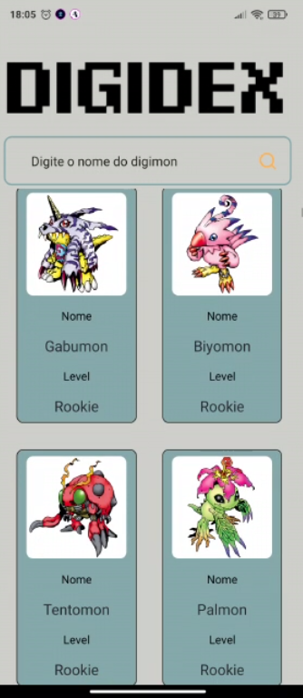
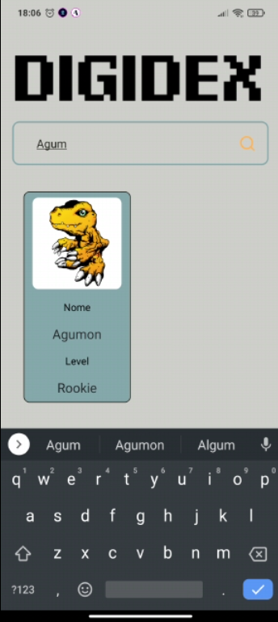

<h1 align="center">
Digidex
</h1>

Projeto criado para explorar as possibilidades do Expo e praticar conhecimentos 

## Preview

## Tecnologias

- [x] React Native
- [x] Styled Components
- [x] TypeScript
- [x] Expo
- [x] Axios

## Instalação

1. Run `npm install` or `yarn install`. 
2. Run yarn start and yarn android.
3. Access your emulator.

##Contato
☎(11) 96139-8325
📧byelg.sousa@gmail.com

Redes Sociais

<a href="https://www.linkedin.com/in/gabriel-sousa-5a719893/">
  </img>
</a>
<a href="https://www.instagram.com/gabrielknoxx">
  </img>
</a>
